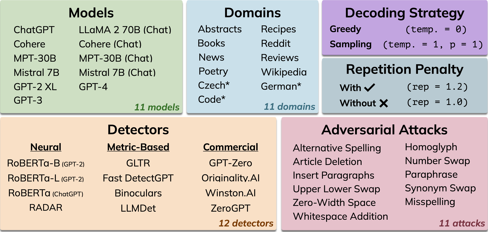
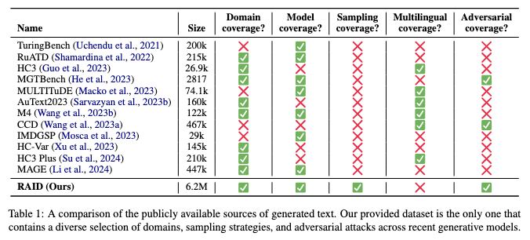

<p align="center">
  &emsp;&nbsp;<a href="https://raid-bench.xyz"></a><br />
  <a href="https://raid-bench.xyz"><b>https://raid-bench.xyz</b></a>
</p>
<p align="center">
   <b>Open Leaderboards. Trustworthy Evaluation. Robust AI Detection.</b>
</p>
<p align="center">
  <a href="https://github.com/liamdugan/raid/actions/workflows/lint.yml"></a>
  <a href="https://pypi.org/project/raid-bench/"></a>
  <a href="https://raid-bench.xyz/leaderboard"></a>
  <a href="https://github.com/liamdugan/raid/blob/main/LICENSE"></a>
  <br />
  <a href="https://liamdugan.com/"></a>
  <a href="https://arxiv.org/abs/2405.07940"></a>
</p>

RAID is the largest & most comprehensive dataset for evaluating AI-generated text detectors. It contains over 10 million documents spanning 11 LLMs, 11 genres, 4 decoding strategies, and 12 adversarial attacks. It is designed to be the go-to location for trustworthy third-party evaluation of popular detectors.

<div align="center">
  <table class="docutils align-default">
    <tbody>
        <tr>
          <td colspan="2">
            <p align="center"><b>Installation</b></p> <pre lang="bash">pip install raid-bench</pre>
          </td>
        </tr>
    </tbody>
    <tbody>
        <tr>
          <th class="head">Example Usage</th>
        </tr>
    </tbody>
    <tbody>
        <tr>
          <td>

```py
from raid import run_detection, run_evaluation
from raid.utils import load_data

# Define your detector function
def my_detector(texts: list[str]) -> list[float]:
    pass

# Download & Load the RAID dataset
train_df = load_data(split="train")

# Run your detector on the dataset
predictions = run_detection(my_detector, train_df)

# Evaluate your detector predictions
evaluation_result = run_evaluation(predictions, train_df)
```
&nbsp;
          </td>
        </tr> 
    </tbody>
  </table>
</div>

With RAID you can:

* 🔬 **Train Detectors**: Use our dataset to train large robust detector models
* 🔄 **Evaluate Generalization**: Ensure your detectors maintain high performance across popular generators and domains
* 🤝 **Protect Against Adversaries**: Maintain high performance under common adversarial attacks
* 📊 **Compare to SOTA**: Compare your detector to state-of-the-art models from academia and industry.

<!-- # RAID: Robust AI Detection

This repository contains the code for the ACL 2024 paper [RAID: A Shared Benchmark for Robust Evaluation of Machine-Generated Text Detectors](https://arxiv.org/abs/2405.07940). In our paper we introduce the RAID dataset and use it to show that current detectors are easily fooled by adversarial attacks, variations in sampling strategies, repetition penalties, and unseen generative models. -->

## News

- **[Sep 24 2024]** **ANNOUNCEMENT** - RAID will appear as a Shared Task at **COLING 2025**! See the [Github](https://github.com/liamdugan/COLING-2025-Workshop-on-MGT-Detection-Task-3) and [Website](https://genai-content-detection.gitlab.io/) for more details! Submission Deadline is October 25th 2024.

## Dataset Overview

The RAID dataset includes over 10 million generations from the following categories:

<!-- <p align="center">
  
</p> -->

|Category| Values|
| -------- | :-------: |
|**Models**|ChatGPT, GPT-4, GPT-3 (text-davinci-003), GPT-2 XL, Llama 2 70B (Chat), Cohere, Cohere (Chat), MPT-30B, MPT-30B (Chat), Mistral 7B, Mistral 7B (Chat)|
|**Domains**|ArXiv Abstracts, Recipes, Reddit Posts, Book Summaries, NYT News Articles, Poetry, IMDb Movie Reviews, Wikipedia, Czech News, German News, Python Code|
|**Decoding Strategies**|Greedy (T=0), Sampling (T=1), Greedy + Repetition Penalty (T=0, Θ=1.2), Sampling + Repetition Penalty (T=1, Θ=1.2)|
|**Adversarial Attacks**|Article Deletion, Homoglyph, Number Swap, Paraphrase, Synonym Swap, Misspelling, Whitespace Addition, Upper-Lower Swap, Zero-Width Space, Insert Paragraphs, Alternative Spelling|

### Comparison
<p align="center">
  
  <p align="center">
    <b>RAID is the only dataset that covers diverse models, domains, sampling strategies, and attacks</b><br />
    See our <a class="reference external" href="https://aclanthology.org/2024.acl-long.674/" title="demo.py">ACL 2024 paper</a> for a more detailed comparison
  </p>
</p>

## Download RAID
The partitions of the RAID dataset we provide are broken down as follows:
|&emsp;&emsp;&emsp;&emsp;&emsp;&emsp;&emsp;| Labels? | Domains | Dataset Size (w/o adversarial) | Dataset Size (w/ adversarial) |
| -------- | :-------: | :-------: | :-------: | :-------: |
|**RAID-train**|✅|News, Books, Abstracts, Reviews, Reddit, Recipes, Wikipedia, Poetry|802M|11.8G| 
|**RAID-test**|❌|News, Books, Abstracts, Reviews, Reddit, Recipes, Wikipedia, Poetry|81.0M|1.22G|
|**RAID-extra**|✅|Code, Czech, German|275M|3.71G|

To download RAID via the pypi package, run
```py
from raid.utils import load_data

# Download the RAID dataset with adversarial attacks included
train_df = load_data(split="train")
test_df = load_data(split="test")
extra_df = load_data(split="extra")

# Download the RAID dataset without adversarial attacks
train_noadv_df = load_data(split="train", include_adversarial=False)
test_noadv_df = load_data(split="test", include_adversarial=False)
extra_noadv_df = load_data(split="extra", include_adversarial=False)
```

You can also manually download the data using `wget`
```
$ wget https://dataset.raid-bench.xyz/train.csv
$ wget https://dataset.raid-bench.xyz/test.csv
$ wget https://dataset.raid-bench.xyz/extra.csv
$ wget https://dataset.raid-bench.xyz/train_none.csv
$ wget https://dataset.raid-bench.xyz/test_none.csv
$ wget https://dataset.raid-bench.xyz/extra_none.csv
```

**NEW: You can also now download RAID through the [HuggingFace Datasets 🤗](https://huggingface.co/datasets/liamdugan/raid) Library**
```py
from datasets import load_dataset
raid = load_dataset("liamdugan/raid")
```

## Leaderboard Submission

To submit to the leaderboard, you must first get predictions for your detector on the test set. You can do so using either the pypi package or the CLI:

### Using Pypi
```py
import json

from raid import run_detection, run_evaluation
from raid.utils import load_data

# Define your detector function
def my_detector(texts: list[str]) -> list[float]:
    pass

# Load the RAID test data
test_df = load_data(split="test")

# Run your detector on the dataset
predictions = run_detection(my_detector, test_df)

with open('predictions.json') as f:
    json.dump(predictions, f)
```

### Using CLI

```
$ python detect_cli.py -m my_detector -d test.csv -o predictions.json
```

After you have the `predictions.json` file you must then write a metadata file for your submission. Your metadata file should use the template found in
this repository at `leaderboard/template-metadata.json`.

Finally, fork this repository. Add your generation files to `leaderboard/submissions/YOUR-DETECTOR-NAME/predictions.json` and your metadata file to `leaderboard/submissions/YOUR-DETECTOR-NAME/metadata.json` and make a pull request to this repository.

Our GitHub bot will automatically run evaluations on the submitted predictions and commit the results to
`leaderboard/submissions/YOUR-DETECTOR-NAME/results.json`. If all looks well, a maintainer will merge the PR and your
model will appear on the leaderboards!

> [!NOTE]
> You may submit multiple detectors in a single PR - each detector should have its own directory.

<!-- ### Pypi package (recommended)

If you want to run RAID on a new detector, we recommend using our pypi package. To install first run `pip install raid-bench` and then use the `run_detection` and `run_evaluation` functions as follows: 

Example:
```py
from raid import run_detection, run_evaluation
from raid.utils import load_data

# Define your detector function
def my_detector(texts: list[str]) -> list[float]:
    pass

# Load the RAID dataset
train_df = load_data(split="train")

# Run your detector on the dataset
predictions = run_detection(my_detector, train_df)

# Run evaluation on your detector predictions
evaluation_result = run_evaluation(predictions, train_df)
``` -->

## Installing from Source

If you want to run the detectors we have implemented or use our dataset generation code you should install from source. To do so first clone the repository. Then install in your virtual environment of choice

Conda:

```
conda create -n raid_env python=3.9.7
conda activate raid_env
pip install -r requirements.txt
```

venv:

```
python -m venv env
source env/bin/activate
pip install -r requirements.txt
```

Then, populate the `set_api_keys.sh` file with the API keys for your desired modules (OpenAI, Cohere, API detectors, etc.). After that, run `source set_api_keys.sh` to set the API key evironment variables.

To apply a detector to the dataset through our CLI run `detect_cli.py` and `evaluate_cli.py`. These wrap around the `run_detection` and `run_evaluation` functions from the pypi package. The options are listed below. See `detectors/detector.py` for a list of valid detector names.

```
$ python detect_cli.py -h
  -m, --model           The name of the detector model you wish to run
  -d, --data_path       The path to the csv file with the dataset
  -o, --output_path     The path to write the result JSON file
```

```
$ python evaluate_cli.py -h
  -r, --results_path    The path to the detection result JSON to evaluate
  -d, --data_path       The path to the csv file with the dataset
  -o, --output_path     The path to write the result JSON file
  -t, --target_fpr      The target FPR to evaluate at (Default: 0.05)
```

Example:
```
$ python detect_cli.py -m gltr -d train.csv -o gltr_predictions.json
$ python evaluate_cli.py -i gltr_predictions.json -d train.csv -o gltr_result.json
```

The output of `evaluate_cli.py` will be a JSON file containing the accuracy of the detector on each split of the RAID dataset at the target false positive rate as well as the thresholds found for the detector.

### Running custom detectors via CLI

If you would like to implement your own detector and still run it via the CLI, you must add it to `detectors/detector.py` so that it can be called via command line argument.

## Citation

If you use our code or findings in your research, please cite us as:

```
@inproceedings{dugan-etal-2024-raid,
    title = "{RAID}: A Shared Benchmark for Robust Evaluation of Machine-Generated Text Detectors",
    author = "Dugan, Liam  and
      Hwang, Alyssa  and
      Trhl{\'\i}k, Filip  and
      Zhu, Andrew  and
      Ludan, Josh Magnus  and
      Xu, Hainiu  and
      Ippolito, Daphne  and
      Callison-Burch, Chris",
    booktitle = "Proceedings of the 62nd Annual Meeting of the Association for Computational Linguistics (Volume 1: Long Papers)",
    month = aug,
    year = "2024",
    address = "Bangkok, Thailand",
    publisher = "Association for Computational Linguistics",
    url = "https://aclanthology.org/2024.acl-long.674",
    pages = "12463--12492",
}
```

## Acknowledgements

This research is supported in part by the Office of the Director of National Intelligence (ODNI), Intelligence Advanced Research Projects Activity (IARPA), via the HIATUS Program contract #2022-22072200005. The views and conclusions contained herein are those of the authors and should not be interpreted as necessarily representing the official policies, either expressed or implied, of ODNI, IARPA, or the U.S. Government. The U.S. Government is authorized to reproduce and distribute reprints for governmental purposes notwithstanding any copyright annotation therein.

<!-- ## Dev Notes

We use [Black](https://black.readthedocs.io/en/stable/) code style and [isort](https://pycqa.github.io/isort/) for code
cleanliness.

See https://packaging.python.org/en/latest/guides/writing-pyproject-toml/ for Python packaging instructions. Publishing
a new release on GitHub will automatically deploy to PyPI.

To bump the package version, use `hatch version [major|minor|patch]` or edit `raid/_version.py`. -->
